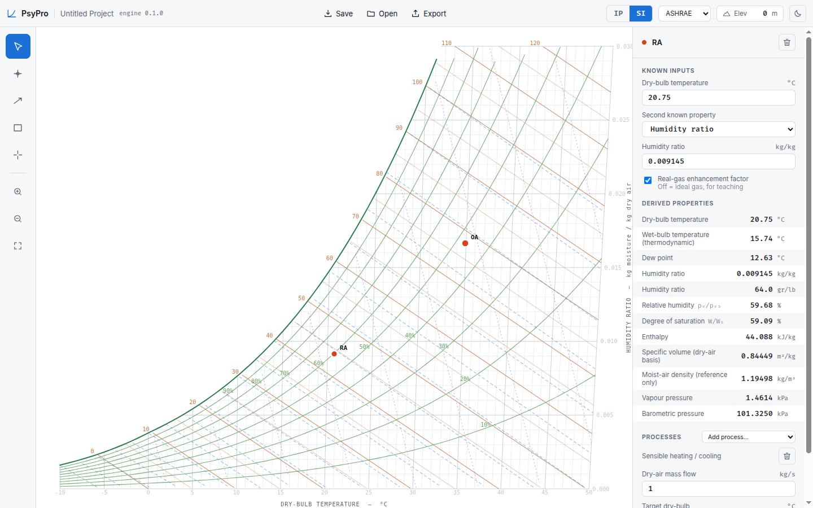
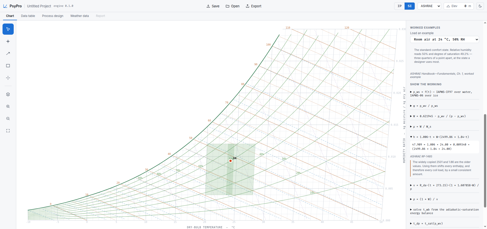
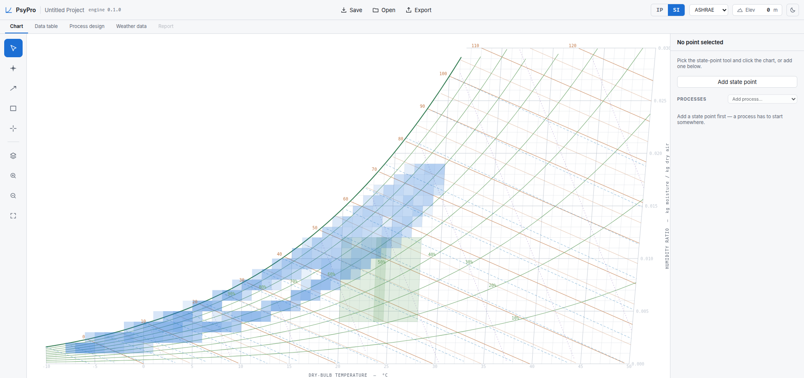
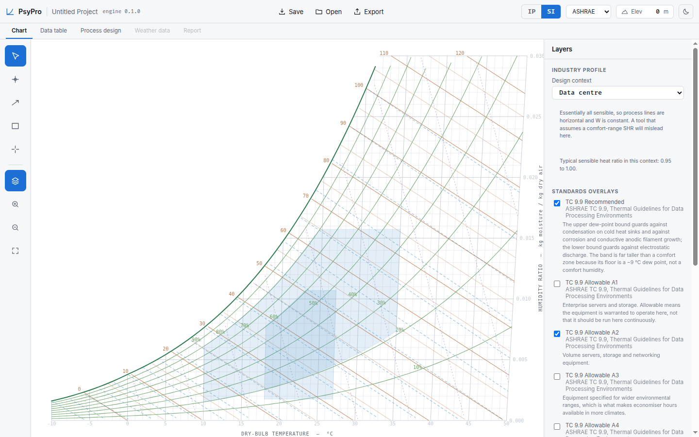

# PsyPro

A free, open-source **psychrometric chart** for air-conditioning design — ASHRAE and
Mollier layouts, a CoolProp-grade calculation engine compiled to WebAssembly, and a
fully client-side app you can run in a browser tab or self-host with one Docker
command.

[](https://github.com/ernsoylu/psypro/actions/workflows/ci.yml)
[](LICENSE)



## Features

- **Two chart layouts** — the ASHRAE dry-bulb/humidity-ratio chart and the Mollier
  enthalpy/humidity-ratio (i–x) chart, both with the field's characteristic oblique
  grid, computed — not drawn — for whichever altitude you set.
- **A real properties engine.** Every state property (wet-bulb, dew point, enthalpy,
  degree of saturation, …) comes from [frees](https://github.com/ernsoylu/frees-wasm),
  a first-party Rust engine wrapping CoolProp-grade property formulations, compiled to
  WASM. TypeScript never reimplements psychrometric math — the two sides of the app
  cannot drift apart.
- **Interactive points.** Drag a state point anywhere on the canvas; every derived
  property follows in the panel. SI and IP units, sea level to altitude.
- **Processes and equipment.** Heating, cooling, humidification, adiabatic mixing,
  coil models with bypass factor, cycle macros, and a Process Design page — each
  verified against worked textbook cases.
- **Teaching mode.** Worked examples that show the working: every step written out
  and cited back to its source, so the chart explains itself.
- **Standards overlays.** Comfort zones and industry envelopes (e.g. data-centre
  thermal guidelines) rendered as data and recomputed at your altitude.
- **Bring-your-own weather.** Drop in an `.epw` or CSV of hourly data; it is parsed in
  a Web Worker (the UI never blocks) and binned onto the chart.
- **Export and persistence.** Save projects to disk, and export charts as SVG, PNG,
  CSV, or DXF for CAD.
- **Yours to restyle.** A line-styling matrix controls color, dash, and width per
  property family; every color routes through CSS variables, so a fork rebrands by
  editing one stylesheet.

| | |
|---|---|
|  |  |
| *Teaching mode — the working shown, every step cited* | *BYOD weather — 8760 hours binned in a Web Worker* |
|  | |
| *Standards overlays and industry profiles, computed at altitude* | |

## Architecture

Three layers with a hard separation of concerns — the boundaries are what keep the
project forkable and unit-testable. Full detail lives in
[REQUIREMENTS.md](REQUIREMENTS.md) and [DEVELOPMENT_PLAN.md](DEVELOPMENT_PLAN.md).

```
React-Konva layers ── Zustand stores ── useChartTransform ── WASM engine
   (rendering)          (state)          (chart → pixels)      (physics)
```

1. **Rust → WASM calculation engine.** All thermodynamics lives in Rust
   (`crates/psychro-core` over `frees-core` → CoolProp-grade properties), compiled
   via `wasm-bindgen`. The engine is stateless: every call takes explicit inputs —
   including altitude and unit system — and returns a result. The vendored
   `vendor/frees-wasm` submodule is first-party; gaps get fixed upstream there, never
   worked around here.
2. **Coordinate transformation in two stages.** Physical → chart space happens in
   WASM (`get_coordinate_mapping`), because the skewed axes differ between the ASHRAE
   and Mollier layouts. Chart space → screen pixels happens in the `useChartTransform`
   React hook, which owns zoom, pan, and the canvas box. Dragging runs the inverse
   round-trip at 60 FPS.
3. **State and rendering.** Three Zustand stores (project settings / points and
   processes / styling), plain TypeScript so they test without mounting React.
   Rendering is a strict five-layer pipeline; the base grid is cached and only
   regenerated when units, altitude, or layout change.

There is **no backend**: weather files are yours, project files use the File System
Access API, and nothing phones home.

## Quick start (development)

You need Rust (with the `wasm32-unknown-unknown` target), `wasm-pack` 0.15, and
Node 20.

```sh
git clone --recurse-submodules https://github.com/ernsoylu/psypro.git
cd psypro/web
npm ci
npm run dev        # builds the WASM engine first, then starts Vite
```

`npm run build` produces the production bundle in `web/dist`. Tests: `npm test`
(frontend), `cargo test --workspace` (engine).

## Self-hosting

PsyPro is a static site — any web server works. Three ready-made options:

### 1. Docker (build from source)

```sh
docker build -t psypro .
docker run -p 8080:80 psypro
# → http://localhost:8080
```

The three-stage image mirrors CI's toolchain pins (same wasm-pack, same Node major)
and serves the bundle behind nginx with an SPA fallback.

### 2. Prebuilt container from GitHub Container Registry

Version tags publish the image automatically (see
[`.github/workflows/release.yml`](.github/workflows/release.yml)):

```sh
docker pull ghcr.io/ernsoylu/psypro:latest      # or a specific tag, e.g. :v0.1.0
docker run -p 8080:80 ghcr.io/ernsoylu/psypro:latest
```

### 3. GitHub Pages

Every merge to `main` builds and deploys the site
([`.github/workflows/deploy.yml`](.github/workflows/deploy.yml)). To enable it on a
fork: **Settings → Pages → Source: GitHub Actions**, then merge to `main`. The bundle
is built with a relative base path, so it serves correctly from a project subpath.

## Contributing

Bug reports, fixes, and features via pull request — see
[DEVELOPMENT_PLAN.md](DEVELOPMENT_PLAN.md) for what is built and what is open. CI
(`.github/workflows/ci.yml`) runs format, lint, typecheck, and the full test matrix on
every PR.

### Contributing a translation

The UI is i18n-ready and ships with English. Adding a language needs no React changes:

1. Copy [`web/src/i18n/en.json`](web/src/i18n/en.json) to `<code>.json` (e.g.
   `de.json`) and translate every value. Keys are flat (`"toolbar.save"`), placeholders
   look like `{count}` and must keep their names.
2. Register it in [`web/src/i18n/index.ts`](web/src/i18n/index.ts): add the code to
   `LOCALES`, import the bundle, and add it to `BUNDLES`.
3. Run `npm run typecheck`. The English bundle is the schema — `TranslationKey` is
   derived from it and `BUNDLES` is typed against it, so a missing key, an extra key,
   or a mistyped placeholder slot is a compile error, not a runtime surprise.

At runtime a missing string renders its key (deliberately visible) and falls back to
English; components read strings through the `useT()` hook, and a test fails the build
if a literal string ever sneaks into a component instead.

## License

[MIT](LICENSE). The dependency audit — every npm package and crate, with the one
dev-only MPL-2.0 finding adjudicated — is in
[`docs/license-audit.md`](docs/license-audit.md).
